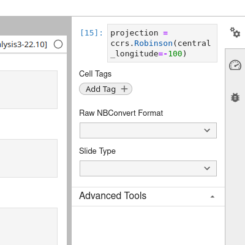

Notebook Guidelines
===================

For optimum presentation in the gallery, notebooks should follow a few
simple rules:

1. The first cell must be a Markdown cell containing a level-1 title,
   beginning with ``#``
2. Other headings within the notebook should be hierarchical. That is,
   sub-headings are level-2 (beginning with ``##``), then
   sub-sub-headings are level-3, and so on.


Thumbnails
----------

By default, the chosen thumbnail is the last matplotlib figure in the
notebook. There are two ways to override this, depending on whether
you want the thumbnail to come from a different figure, or from a
static image. To select a different figure, tag the cell with
``nbsphinx-thumbnail``. This is different depending on whether you use
Jupyter Notebook or JupyterLab:

1. **Jupyter Notebook**. You can enable the cell tag toolbar through
   *View -> Cell Toolbar -> Tags*, and use this to add the thumbnail tag.

.. image:: _static/screenshots/tags_notebook.png
   :align: center

2. **JupyterLab**. Click the gear icon (|gear|) at the top-right
   corner of the page, or *View -> Show Right Sidebar*. From here, you
   can add cell tags.



Otherwise, if you want a thumbnail from an external image, place it in
the ``docs/_static/thumbnails`` directory, and add an entry to the
``nbsphinx_thumbnails`` directory in ``docs/conf.py``, following the
format for the other entries already in there.


Images in notebooks
-------------------

If including external images (i.e. not plots generated in the code) in
notebooks, place them in the ``images/`` directory next to the
notebook. Use the syntax ```` to
include the image in the notebook.

